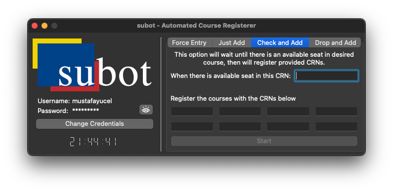

# subot - Automated Course Registerer for Sabanci University

- [subot - Automated Course Registerer for Sabanci University](#subot---automated-course-registerer-for-sabanci-university)
  - [Introduction](#introduction)
  - [What does it do?](#what-does-it-do)
  - [Built with](#built-with)
  - [Installation & Usage](#installation--usage)
    - [Download the installer](#download-the-installer)
    - [Make sure you have Google Chrome installed](#make-sure-you-have-google-chrome-installed)
    - [Provide your SUCourse username and password, click on save button](#provide-your-sucourse-username-and-password-click-on-save-button)
    - [Force Entry, will only get you to the Add/Drop page](#force-entry-will-only-get-you-to-the-adddrop-page)
    - [Just Add, will get you to the Add/Drop page and add courses](#just-add-will-get-you-to-the-adddrop-page-and-add-courses)
    - [Check and Add, will get you to the Add/Drop page and add courses when there is space](#check-and-add-will-get-you-to-the-adddrop-page-and-add-courses-when-there-is-space)
    - [Drop and Add, will get you to the Add/Drop page and drop and add desired courses](#drop-and-add-will-get-you-to-the-adddrop-page-and-drop-and-add-desired-courses)
  - [Detailed steps for compiling code on your own computer (Some steps are specific to macOS)](#detailed-steps-for-compiling-code-on-your-own-computer-some-steps-are-specific-to-macos)
    - [Step 1: Installing Dependencies for running the code](#step-1-installing-dependencies-for-running-the-code)
    - [Step 2: Installing Dependencies for packaging the code into executable](#step-2-installing-dependencies-for-packaging-the-code-into-executable)

## Introduction
Course registration periods in Sabanci University can be painful, especially if you could not login in time due to high loads on servers and had to check for an available seat for an already full class for 5 days, by hand. subot is designed to eliminate and automate this time consuming process.

## What does it do?
Using Google Chrome installed on your computer:

- tries to login to the site and register desired classes
- checks the number of available seats in the course until a space is available, on the possibility that anyone who has successfully taken the course will drop out, then, immediately, fills the space

## Built with

- [Python](https://www.python.org) - A powerful scripting language
- [Qt Creator](https://www.qt.io/product/development-tools) - An app for interface design
- [PyQt5](https://pypi.org/project/PyQt5/) - GUI library for Python
- [Selenium](https://www.selenium.dev/documentation/) - A library for browser automation
- [PyInstaller](https://pyinstaller.org/en/stable/) - A library for creating executable Python apps

## Installation & Usage

### Download the installer

- Click <a id="raw-url-arm" href="https://raw.githubusercontent.com/mustafaaycll/sabanci-adddropbot/main/release_AppleSilicon/subot.dmg">here</a> if you use an ARM Mac (M1, M1 Pro, M1 Max, M2)
- Click <a id="raw-url-i386" href="https://raw.githubusercontent.com/mustafaaycll/sabanci-adddropbot/main/release_IntelSilicon/sorry.txt">here</a> if you use an Intel Mac
- There is no MS Windows version, feel free to copy and modify the code to develop one.
- With some little modifications to the source code, bot should be easily compiled and built on any Linux desktop.

### Make sure you have Google Chrome installed

- Bot, for now, uses Google Chrome 106.x
- Any other Google Chrome, such as v105 or 107, will cause errors. To learn your Google Chrome version, head to the Google Chrome settings and click on the "About Chrome" button on the left pane.

### Provide your SUCourse username and password, click on save button

### Force Entry, will only get you to the Add/Drop page

### Just Add, will get you to the Add/Drop page and add courses

### Check and Add, will get you to the Add/Drop page and add courses when there is space

### Drop and Add, will get you to the Add/Drop page and drop and add desired courses

## Detailed steps for compiling code on your own computer (Some steps are specific to macOS)

### Step 1: Installing Dependencies for running the code

- (Mac specific) If not installed, install Homebrew. It will be used to install python and other python libraries. Even if Python is already installed, Homebrew will also be used to install another dependency.

    `/bin/bash -c "$(curl -fsSL https://raw.githubusercontent.com/Homebrew/install/HEAD/install.sh)"`

- (Mac specific) If not installed, install Python

    `brew install python`

    Python can also be installed using the installer downloaded from the website. Using brew makes it easy to uninstall or update it.

- Install Python packages

    PyQt5, for GUI library

    `brew install pyqt@5` or `pip3 install PyQt5`

    Selenium and Webdriver Manager for browser automation

    `pip3 install selenium webdriver-manager`

### Step 2: Installing Dependencies for packaging the code into executable

- PyInstaller, for packaging the app into one executable

    `pip3 install pyinstaller`

- `create-dmg`, for creating macOS disk images

    `brew install create-dmg`

